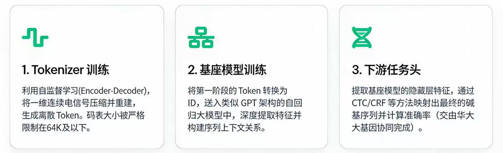
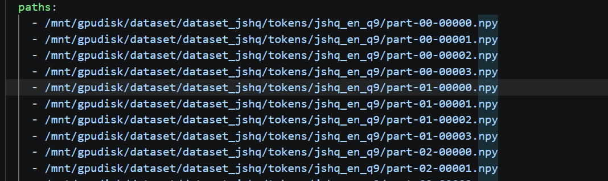
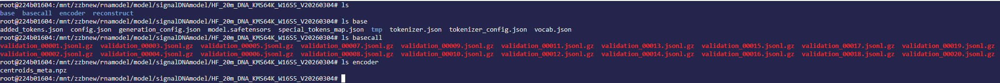

# 🧬PoreGPT:  A GPT-based LLM for Nanopore signal

PoreGPT 是首个直接在原始 Nanopore 电流信号（raw squiggle）上进行建模的大语言模型（LLM）框架。不同于传统方法依赖碱基识别（basecalling）后的 DNA 序列，PoreGPT 通过自研的 向量量化（VQ）信号 tokenizer，将连续、高维、含噪的电信号转化为离散 token 序列，从而在信号原生空间中学习序列-结构-修饰的深层关联。
借助 Transformer 架构的强大泛化能力，PoreGPT 能够：
直接从 raw signal 预测 DNA/RNA 序列（免 basecaller）
检测表观遗传修饰（如 5mC、6mA）
重建缺失信号片段
为下游任务（如 variant calling、RNA isoform 分析）提供统一预训练表示
PoreGPT 开启了“端到端信号智能”的新范式，让大模型真正“听见”DNA 的电流之声。
> 将 Nanopore 原始电流信号（5 kHz）转换为离散 token 序列，用于下游语言模型（如 GPT）建模 DNA/RNA 序列。

[](https://www.python.org/)
[](https://pytorch.org/)
[](LICENSE)

---

## 🔍 简介
本工具提供两种 Nanopore 原始电流信号（单位：pA）的 token 化方案，可将连续电流信号转换为结构化离散符号序列。适配不同建模需求：适用场景
Nanopore 信号语言建模（Signal LM）；
无参考序列的 RNA/DNA 表征学习；
多模态生物信息学分析流程（pipeline）构建。

1. RVQ Tokenizer（残差矢量量化）
基于自监督残差矢量量化（Residual VQ）模型实现信号 token 化，输出格式示例：<|bwav:L1_5336|><|bwav:L2_7466|><|bwav:L3_6973|><|bwav:L4_6340|>

核心特性：
支持 L1~L4 多层级 token 输出，可灵活适配不同粒度的建模任务；
兼容 FAST5 格式文件与原始浮点信号数组两种输入形式；
内置信号归一化 + Butterworth 滤波流程，提升 token 化鲁棒性；
支持长信号分块处理（滑动窗口 + 重叠策略），适配长序列建模场景

2. KMeans Tokenizer（Kmeans聚类）
基于 faiss K-Means 聚类算法实现信号 token 化：先通过聚类生成指定数量的聚类中心，再将电流信号切片为固定维度向量，通过匹配最相似的聚类中心向量，以聚类编号替换原始信号完成 token 化。注意：faiss keans不支持int64个向量的聚类，所以目前只支持2B（20亿）个向量的聚类。

本工具转换的格式为`<|bwav:5018|><|bwav:8156|><|bwav:23|><|bwav:5725|><|bwav:418|>`, 与后面的vq_tokenizer是一样的格式。

3. VQ tokenizer 

仅仅一层的离散化，支持将一个原始电流信号，转换为 `<|bwav:5808|><|bwav:702|><|bwav:330|><|bwav:6238|><|bwav:2432|>` 格式，其中数字从0拍到8191（在8k codebook情况下）


## ⚙️ 安装

### 从源码安装（推荐）

```bash
git clone https://github.com/lovearthai/poregpt.git
cd nanopore_signal_tokenizer
pip install -e . 
#如果阿里源报错，切换清华源或官方源 
pip install -e . \
  --no-build-isolation \
  -i https://pypi.tuna.tsinghua.edu.cn/simple/ \
  --extra-index-url https://pypi.org/simple/ \
  --trusted-host pypi.tuna.tsinghua.edu.cn \
  --trusted-host pypi.org \
  --trusted-host files.pythonhosted.org

pip install vector-quantize-pytorch -i https://pypi.org/simple/
conda install -c pytorch faiss-gpu  
```

##  VQE_tokenizer

### 检查检查点格式

一个合格的检查点格式如下
```
.
├── metadata.json
├── model.safetensors
├── optimizer.bin
├── random_states_0.pkl
└── scheduler.bin
```
其中metadata.json内容举例如下：
```
{"epoch": 0, "spoch": 0, "global_step": 10000, "cnn_type": 7, "model_type": 3}
```

### 初始化 Tokenizer

```python
import numpy as np
from poregpt.tokenizers.vqe_tokenizer import VQETokenizer


tokenizer = VQETokenizer(
    model_ckpt="models/example_vqe_tokenizer.pth",
    token_batch_size=100
)

```

"""
##  配置参数说明
| 参数 | 说明 | 默认值 |
|------|------|--------|
| `model_ckpt` | 预训练模型路径目录 | 必填 |
| `device` | 推理设备 | `"cuda"`,如果不填 |
"""


## 加载VQE检查点会有如下输出
```bash
✅ Using device: cuda
📂 Loading checkpoint: models/example_vqe_tokenizer.pth
🎯 Inferred: codebook_size=65536, dim=512, cnn_type=7
codebook_dim:512
Intialized VectorQuantize with the following hyperparameters:
  dim: 512
  codebook_size: 65536
  kmeans_init: True
  kmeans_iters: 10
  decay: 0.99
  threshold_ema_dead_code: 2
  commitment_weight: 1.0
  codebook_diversity_loss_weight: 1.0
  orthogonal_reg_weight: 1.0
  orthogonal_reg_max_codes: 256
  orthogonal_reg_active_codes_only: True
  cnn_type: 7
------------------------------------------------------------

✅ VQTokenizer initialized:
   Checkpoint       : /mnt/nas_syy/default/poregpt/poregpt/poregpt/test/test_vqe_tokenizer/models/example_vqe_tokenizer.pth
   Device           : cuda
   Model type       : 3
   Codebook size    : 65536
   Latent dim       : 512
   Downsample rate  : 5
   Chunk size       : 500
   Margin           : 10 samples
------------------------------------------------------------
```
注意：downsample_rate、chunk_size、margin 等参数由模型 checkpoint 自动推断，不可手动覆盖

### 对一段信号进行token化-默认开启huada归一化

```python

import numpy as np

# 模拟一段信号（单位：pA，长度任意 ≥ 25）
signal = np.random.randn(1000).astype(np.float32) * 5 + 100

# 默认返回 token 列表（每个元素是字符串，如 "<|bwav:1234|>"）
tokens_list = tokenizer.tokenize_data(signal)
print(len(tokens_list))        # 输出 token 数量
print("".join(tokens_list[:10]))  # 拼接前10个 token
```

### 对一段信号进行token化-确保在调用tokenize_data函数之前，你已经对signal作了标准化
```
# 模拟一段 1200 点的信号（~240ms @ 5kHz）
signal = np.random.randn(1000).astype(np.float32) * 5 + 100
# 获取全部层级 token (L1–L4)
tokens_list = tokenizer.tokenize_data(signal)
print(len(tokens_list))
tokens_str = "".join(tokens_list[:20])
print(tokens_str)
# <|bwav:L1_1309|><|bwav:L1_4762|><|bwav:L1_4762|><|bwav:L1_4762|><|bwav:L1_4762|><|bwav:L1_4762|><|bwav:L1_4762|><|bwav:L1_4762|><|bwav:L1_4762|><|bwav:L1_4762|><|bwav:L1_4762|><|bwav:L1_4762|><|bwav:L1_4762|><|bwav:L1_4762|><|bwav:L1_4762|><|bwav:L1_4762|><|bwav:L1_4762|><|bwav:L1_4762|><|bwav:L1_4762|><|bwav:L1_4762|>

```


### 对一个fast5文件进行token化
文件自动 gzip 压缩（.gz 后缀）
自动跳过无效或过短的 reads
支持 single-read 和 multi-read FAST5

```
#输出为 gzip 压缩的 JSONL 格式：
tokenizer.tokenize_fast5(
    fast5_path="fast5/demo.fast5",
    output_path="fast5/demo.jsonl.gz",
    nanopore_signal_process_strategy="stone"
)

```

输出的jsonl.gz内容格式

```
{"id": "read_12345", "text": "<|bwav:5808|><|bwav:702|><|bwav:330|>..."}
{"id": "read_67890", "text": "<|bwav:2432|><|bwav:812|>..."}
```

## Kmeans Tokenizer


## RVQ Tokenizer


1. 预训练模型准备
RVQ Tokenizer：将预训练 checkpoint 文件（如 nanopore_rvq_tokenizer_chunk12k.pth）放入项目 models/ 目录；
KMeans Tokenizer：直接使用 models/ 目录下的 centroids.npy 聚类中心文件。
2. 信号 Token 化示例
RVQ Tokenizer 使用示例：参考 test/ 目录下 example_rvq_tokenizer_data.py；
KMeans Tokenizer 使用示例：参考 test/ 目录下 example_kmeans_tokenize_data.py。


# basecall语料准备

## 对一批fast5文件计算对应的out_summary.processed.tsv文件和对应的references.npy文件

### out_summary.processed.tsv 这个文件里的格式如下
filename        read_id chunk_start     chunk_size      alignment_identity
validation_00003.fast5  250F701901011_23_2561_1360_397804127_558818     3000    6000    1.0
validation_00005.fast5  250F701901011_23_2561_1360_397804127_558818     6000    6000    1.0
validation_00004.fast5  250F701901011_23_2561_1360_397804127_558818     9000    6000    1.0
validation_00006.fast5  250F701901011_23_2561_1360_397804127_558818     12000   6000    1.0

### references.npy里包含相同行数的np.array. 格式如下File: references.npy
Data Type: uint8
Shape: (537111, 762)
Number of dimensions: 2
Total number of elements: 409278582
Size in bytes: 409278582

### 合并tsv和npy文件 成 .bc.csv文件

同时打开这两个文件，将npy里对应的数组读出来，把里面的0去掉。保存成12345这样的字符串， 然后增加一项 bases 用来表达这些数字字符串。 最后保存成csv: 表头是fast5, read_id, chunk_start, chunk_size, alignment_identity, bases

脚本: merge_tsv_and_npy_to_bccsv.sh 就是来执行这个合并操作， 它的功能是递归遍历一个目录下的所有子目录，如果这个子目录中有out_summary.processed.tsv和references.npy，合并成一个以子目录命名的.bc.csv文件。并且用multiprocessing_pool来并行处理。

# 开发环境相关（By Kexuan）

1. 登录邹老师账号，选取V5000+W64集群，新建开发环境，

选取镜像： 10.200.53.208/003067/w64-olmo-poregpt:5.0.0-ccf5

选取GPU（两卡或八卡）

挂载存储： si003067jezr/default、zzbnew/dnadata、zzbnew/rnamodel、zzbnew/default、

2. 共享给个人账号

3. 镜像包含了运行所需的各类代码库，在国产卡沐曦上新建conda环境会比较麻烦，直接在南湖系统上打开开发环境的终端，然后在这个终端里bash run.sh脚本

# pipline（By Kexuan）




## 按仓库划分：
1. 第一阶段tokenizer训练：https://github.com/Zhoukek/poregpt/tree/team-dev

2. 第二阶段基座模型训练：https://github.com/Zhoukek/OLMo#

3. 第三阶段basecall训练：https://github.com/Zhoukek/dcbasecaller/tree/team-dev


## 1. (第一阶段)tokenizer训练入口（举例，已调整完毕）：

(1) **训练tokenizer**：
```
在南湖开发环境的终端里：
cd poregpt\workflows\vqe_workflow\step02_train_vqe_model\try

./run.sh

PS：一阶段所用数据集：

(小，快速验证)：/mnt/si003067jezr/default/poregpt/dataset/human_dna_032g/memap_mongoq30/trank

(大，完整数据集-焦老师预处理策略)：/mnt/si003067jezr/default/poregpt/dataset/human_dna_595g/memap_mongoq30/trank

(大，完整数据集-huada预处理策略)：/mnt/si003067jezr/default/poregpt/dataset/human_dna_595g/memap_stoneq0
```

训练完成会出现：
```
models/porepgt_vqe_tokenizer.step160000.pth
├── metadata.json
├── model.safetensors
├── optimizer.bin
├── random_states_0.pkl
└── scheduler.bin
```

(2) **利用训好的tokenizer模型对数据进行token化**：

利用 /mnt/zzbnew/rnamodel/zhoukexuan/poregpt/poregpt/workflows/vqe_workflow/step05_tokenize_trankdir/step03_tokenize_trankdir_w64_dna032g_vqe101s106000.sh：
~~~
输入: /mnt/.../memap_lemon5/*.npy -> [VQ Tokenizer] (CNN编码器，词汇表大小32k或64k) -> 输出: /mnt/.../jsonlgz_vqe92s160000/相对路径.jsonl.gz
~~~

- 输入 *.npy -> .jsonl.gz

(3) **使用step06_split_jsonlgz**

利用 /mnt/zzbnew/rnamodel/zhoukexuan/poregpt/poregpt/workflows/vqe_workflow/step06_split_jsonlgz/step04_split_dna032g_jsonlgz_vqe101s106000.sh：

~~~
处理前：
/mnt/.../jsonlgz_vqe101s106000/
├── test/*.jsonlgz
├── train/*.jsonlgz
└── validation/*.jsonlgz

处理后：
/mnt/.../jsonlgz_vqe101s106000_split1280_overlap1024/
├── test/*.jsonlgz (每个原文件被切成多个重叠片段)
├── train/*
└── validation/*
~~~

- 输入 jsonlgz_vqe101s106000/ -> vqe101s106000_split1280_overlap1024/

(4) **使用step07_tokenize_basecall_corpus**

利用 /mnt/zzbnew/rnamodel/zhoukexuan/poregpt/poregpt/workflows/vqe_workflow/step07_tokenize_basecall_corpus/run_batch.sh

读取的数据是fast5的数据（不是之前预处理策略后的数据）, 以及对应的csv文件


## 2. (第二阶段)基座模型的训练

~~~
训练采用的是OLMo框架

训练入口：/mnt/zzbnew/rnamodel/zhoukexuan/OLMo/run.sh

~~~

需要的是，获得训练数据的：




问题：
1. 一阶段的step02_train_vqe_model训练完怎么做衔接到二阶段的训练？

2. 基座模型训练所需的数据集是在哪里？

3. 训练完后是不是运行/mnt/zzbnew/rnamodel/zhoukexuan/OLMo/run_olmo_to_hf.sh，把olmo2转换成hf文件格式？


---
二阶段训练完后会构成：




## 3. (第三阶段)基模出来的特征做basecall训练

~~~
训练入口：/mnt/zzbnew/rnamodel/zhoukexuan/poregpt/poregpt/workflows/basecall_workflow/step00_train_ctc_bilstm_0305.sh
~~~

基模存放位置(举例)：/mnt/zzbnew/rnamodel/model/signalDNAmodel/HF_20m_DNA_VQE64K_CNN03_V20260203/base

/mnt/zzbnew/rnamodel/zhoukexuan/poregpt/poregpt/basecall/model.py, BasecallModel带basecall head(上面的基模+head)
~~~
        self.tokenizer = AutoTokenizer.from_pretrained(
            model_path, trust_remote_code=True
        )

        if reset_backbone_weights:
            backbone_config = AutoConfig.from_pretrained(
                model_path,
                trust_remote_code=True,
            )
            self.backbone = AutoModel.from_config(
                backbone_config,
                trust_remote_code=True,
            )
        else:
            self.backbone = AutoModel.from_pretrained(
                model_path,
                trust_remote_code=True,
            )
        ...
        
        if self.head_type == "ctc_crf":
            n_base = head_crf_n_base if head_crf_n_base is not None else (len(ID2BASE) - 1)
            if head_crf_state_len is None:
                if n_base <= 1:
                    raise ValueError("Cannot infer head_crf_state_len with n_base <= 1.")
                base = num_classes / (n_base + 1)
                state_len = math.log(base, n_base) - 1
                if not math.isclose(state_len, round(state_len)):
                    raise ValueError("Unable to infer head_crf_state_len from num_classes and n_base.")
                head_crf_state_len = int(round(state_len))
            self.base_head = LinearCRFEncoder(
                insize=self.pre_head.output_dim,
                n_base=n_base,
                state_len=head_crf_state_len,
                bias=True,
                scale=head_output_scale,
                activation=head_output_activation,
                blank_score=head_crf_blank_score,
                expand_blanks=head_crf_expand_blanks,
            )
        elif self.head_type == "ctc":
            self.base_head = LinearCTCEncoder(
                insize=self.pre_head.output_dim,
                num_classes=num_classes,
                bias=True,
                scale=head_output_scale,
                activation=head_output_activation,
            )
        else:
            raise ValueError(f"Unsupported head_type: {self.head_type}")
~~~

~~~
BasecallModel的forward，输入的是input_ids：

    def forward(
        self,
        input_ids: torch.Tensor,
        attention_mask: torch.Tensor | None = None,
    ) -> torch.Tensor:
        if self.feature_source == "embedding":
            embedding_layer = self.backbone.get_input_embeddings()
            if embedding_layer is None:
                raise ValueError("Backbone does not expose input embeddings via get_input_embeddings().")
            hidden = embedding_layer(input_ids)
        else:
            outputs = self.backbone(
                input_ids=input_ids,
                attention_mask=attention_mask,
                output_hidden_states=True,
                return_dict=True,
            )

            hidden_states = outputs.hidden_states  # tuple(len = n_layers + 1)

            try:
                hidden = hidden_states[self.hidden_layer]
            except IndexError:
                raise ValueError(
                    f"hidden_layer={self.hidden_layer} out of range "
                    f"(num hidden states = {len(hidden_states)})"
                )

        hidden = self.pre_head(hidden)
        logits_btc = self.base_head(hidden)
        return logits_btc
~~~

基座是冻结的，或是解冻最后几层：

~~~
位于poregpt/basecall/model.py：

        # ✅ 冻结基座（核心）
        if self.freeze_backbone or self.unfreeze_last_n_layers > 0 or unfreeze_layer_start is not None or unfreeze_layer_end is not None:
            for p in self.backbone.parameters():
                p.requires_grad = False
            if self.freeze_backbone and self.unfreeze_last_n_layers == 0:
                self.backbone.eval()  # 固定 dropout 等推理行为（推荐）

        # ✅ 可选：仅解冻最后 N 层
        if self.unfreeze_last_n_layers > 0 or unfreeze_layer_start is not None or unfreeze_layer_end is not None:
            layers = self._get_transformer_layers()
            n_layers = len(layers)
            if unfreeze_layer_start is not None or unfreeze_layer_end is not None:
                start = 0 if unfreeze_layer_start is None else int(unfreeze_layer_start)
                end = n_layers if unfreeze_layer_end is None else int(unfreeze_layer_end)
                if start < 0:
                    start = n_layers + start
                if end < 0:
                    end = n_layers + end
                if not 0 <= start <= end <= n_layers:
                    raise ValueError(f"Invalid unfreeze layer range: [{start}, {end}) with {n_layers} layers.")
                target_layers = layers[start:end]
            else:
                n_unfreeze = min(self.unfreeze_last_n_layers, n_layers)
                target_layers = layers[-n_unfreeze:]
            for layer in target_layers:
                for p in layer.parameters():
                    p.requires_grad = True
~~~

**PS：三阶段所用数据集：**

model_name="HF_20m_DNA_VQE64K_CNN03_V20260203"

data_root="/mnt/zzbnew/rnamodel/model/signalDNAmodel/${model_name}/basecall"

以这个为例子：大小1.1G


# 优化路线（By Kexuan）

1. 改进卷积核位置：
```
在config.yaml里的cnn_type=7
然后根据cnn_type，在 poregpt\tokenizers\vqe_tokenizer\cnn_model.py
里有不同的cnn架构
if cnn_type == 0:
  self._build_cnn_type0()
  self.out_channels = 256
  self.stride = 5
  self.receptive_field = 33
  self.RF = 33
...

elif cnn_type == 12:
  self._build_cnn_type12()
  self.out_channels = 512
  self.stride = 4
  self.receptive_field = 49
  self.RF = 49

```

2. 码本构建方式修改：
```
poregpt\tokenizers\vqe_tokenizer\vqe_model_v1.py里的

from vector_quantize_pytorch import VectorQuantize
self.vq = VectorQuantize(
            dim=self.latent_dim,
            codebook_size=codebook_size,
            kmeans_init=True,
            kmeans_iters=10,
            decay=codebook_decay,
            threshold_ema_dead_code=codebook_emadc,
            commitment_weight=commitment_weight,
            codebook_diversity_loss_weight=codebook_diversity_loss_weight,
            orthogonal_reg_weight=orthogonal_reg_weight,
            orthogonal_reg_max_codes=256,
            orthogonal_reg_active_codes_only=True,
            learnable_codebook=learnable_codebook,
            ema_update = ema_update,
        )
会有不同的码本构建方式，

```

在/mnt/zzbnew/rnamodel/zhoukexuan/poregpt/poregpt/tokenizers/vqe_tokenizer 增加 vqe_model_vX.py
然后在 /mnt/zzbnew/rnamodel/zhoukexuan/poregpt/poregpt/tokenizers/vqe_tokenizer/vqe_train.py和/mnt/zzbnew/rnamodel/zhoukexuan/poregpt/poregpt/tokenizers/vqe_tokenizer/vqe_tokenizer.py 的导入部分里加

~~~
from .vqe_model_vX import NanoporeVQEModel_VX

增加或修改：

    elif model_type == X:
        model = NanoporeVQEModel_VX(
            codebook_size=codebook_size,
            codebook_decay=codebook_decay,
            codebook_emadc=codebook_emadc,
            commitment_weight=commitment_weight,
            codebook_diversity_loss_weight=codebook_diversity_loss_weight,
            orthogonal_reg_weight=orthogonal_reg_weight,
            cnn_type=cnn_type,
            init_codebook_path=init_codebook_path,
            cnn_checkpoint_path = cnn_checkpoint_path,
            freeze_cnn = freeze_cnn,
            learnable_codebook=learnable_codebook
        )

修改码本方法，修改下面的部分，换成其他的码本构建方法：

        self.vq = VectorQuantize(
            dim=d_model,
            codebook_size=codebook_size,
            kmeans_init=True,
            kmeans_iters=10,
            decay=codebook_decay,
            threshold_ema_dead_code=codebook_emadc,
            commitment_weight=commitment_weight,
            codebook_diversity_loss_weight=codebook_diversity_loss_weight,
            orthogonal_reg_weight=orthogonal_reg_weight,
            orthogonal_reg_max_codes=256,
            orthogonal_reg_active_codes_only=True,
            learnable_codebook=learnable_codebook,
            ema_update = ema_update,
        )

并修改 conifg.yaml 的model_type部分
~~~


3. chunk相关参数：
```
经过预处理策略的数据集，每个进来的chunk是12000

config.yaml下：
# 输入信号序列的长度 (每个样本的信号点数)
chunk_size: 12000

会有一个下一个chunk，把12000的再切掉
dataset_logic_chunk_size: 2400  

vqe_train.py中：
train_dataset = NanoporeSignalDataset(shards_dir=train_npy_dir,logic_chunk_size=dataset_logic_chunk_size,logic_chunk_overlap_size=100)
还会有一个logic_chunk_overlap_size=100，算出来最后是2560

vqe_model_v3.py中：
 def forward(self, x: torch.Tensor) -> Tuple[torch.Tensor, torch.Tensor, torch.Tensor, Dict]:
        """
        前向传播函数 (升级版：支持 CNN + Transformer 架构)。

        Args:
            x (torch.Tensor): 输入信号，形状 [B, 1, T]
                (例如: B=4, T=2560 -> )

        Returns:
            recon (torch.Tensor): 重建信号，[B, 1, T]
            indices (torch.Tensor): VQ 离散 token，[B, N] (N = T // 5)
            loss (torch.Tensor): VQ 总损失（标量）
            loss_breakdown (dict): 损失分项（commitment, diversity, ortho...）
        """

        # ======================================================================
        # 1. CNN 编码器 (特征提取)
        #    目标：将原始长序列压缩为较短的特征序列
        # ======================================================================
        # 输入 x: [B, 1, T]
        #   (B: Batch Size, 1: 单通道电信号, T: 信号长度 2560)
        z_cnn = self.cnn_model.encode(x)
        # 输出 z_cnn: [B, C_CNN, N]
        #   (C_CNN: CNN 特征维度 = 128, N: 序列长度 = T//5 = 512)
        #   例如:

```

